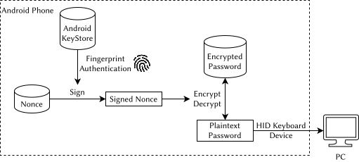

# Ankey

## What?

A simple script to use the biometric sensor on an Android device as an authentication method and type long master passwords into a PC through a USB cable.

https://github.com/husixu1/ankey/assets/15274807/541b7929-56b2-4295-a9fd-c454116928b3

- It is not a full-featured password manager, It merely remembers and types a few long passwords.
- There are alternatives like [Keepass2Android][2] + [K2AUSBKeyboard][3], but I prefer my own simple script.

## Why?
- Typing long passwords repeatedly can be tedious.
- Keepass(xc) on Linux doesn't support fingerprint yet (Seems like it's planned in 2.8.x but who knows...).
- It's hard to buy a Linux-compatible fingerprint sensor that supports libfprint for desktop PC.
- I have an old rooted Android phone that is otherwise useless and collecting dust in my drawer.

## How?

The core operation flow of this script looks like this:

The idea is partially taken from [This post][1]. Signed nonce is used as the encryption key since termux-keystore doesn't support encrypting/decrypting data currently.

### Requirements

- Rooted Android phone with `4.x` or `5.x` kernel (or customized `3.x` kernel with HID enabled).
- Termux environment (with root access, of course). Packages needed:
    - `termux`, `termux-api`: For accessing keystore and fingerprint sensor
    - `fzf`: For the menu
    - `openssl`: For encrypting the password

---

[1]:https://microsounds.github.io/notes/termux-ssh-fingerprint.htm
[2]:https://github.com/PhilippC/keepass2android
[3]:https://github.com/whs/K2AUSBKeyboard
